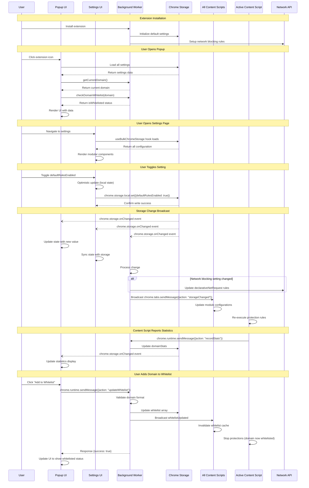
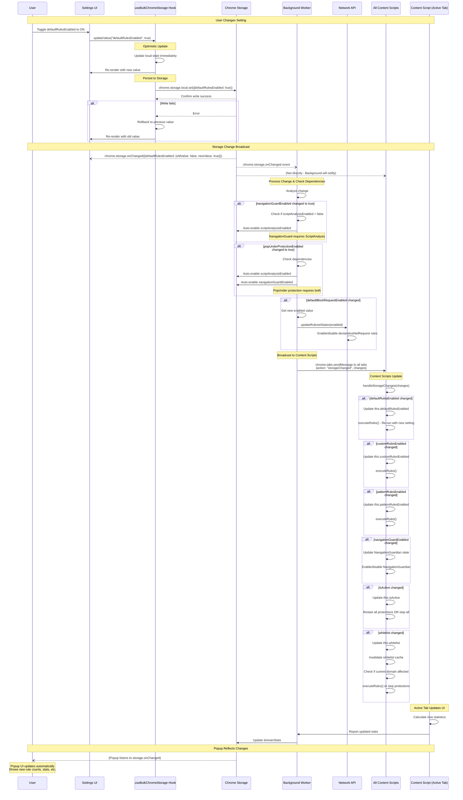
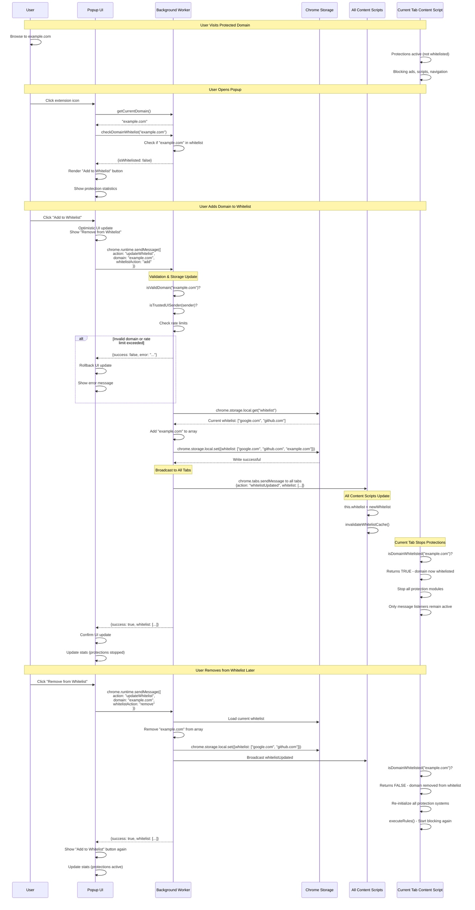

# OriginalUI Chrome Extension - Workflow Diagrams

This document provides comprehensive workflow diagrams for the OriginalUI Chrome Extension, visualizing the complete architecture, data flows, and component interactions.

## Table of Contents

1. [High-Level Architecture](#1-high-level-architecture)
2. [Extension Lifecycle Flow](#2-extension-lifecycle-flow)
3. [Data Flow & Communication](#3-data-flow--communication)
4. [Protection Module Orchestration](#4-protection-module-orchestration)
5. [Settings Synchronization Flow](#5-settings-synchronization-flow)
6. [User Interaction: Whitelist Management](#6-user-interaction-whitelist-management)

---

## 1. High-Level Architecture

This diagram shows the overall system architecture and how major components interact.

```mermaid
graph TB
    subgraph "User Interface Layer"
        Popup[Popup UI<br/>popup.jsx → App.jsx]
        Settings[Settings UI<br/>settings-beta.jsx<br/>Modular Components]
    end

    subgraph "Extension Core"
        Background[Background Service Worker<br/>background.js<br/>- Message routing<br/>- Storage coordination<br/>- Network blocking manager]
    end

    subgraph "Content Layer"
        Content[Content Script<br/>content.js<br/>OriginalUIController]
        Injected[Injected Script<br/>injected-script.js<br/>Page-world interception]
    end

    subgraph "Protection Modules"
        ScriptAnalyzer[ScriptAnalyzer<br/>Threat detection]
        NavGuard[NavigationGuardian<br/>+ SecurityValidator<br/>+ ModalManager]
        ClickProtect[ClickHijackingProtector<br/>Overlay detection]
        Mutation[MutationProtector<br/>DOM monitoring]
        ElementRem[ElementRemover<br/>CSS selector removal]
        AdEngine[AdDetectionEngine<br/>Pattern detection]
    end

    subgraph "Data & Storage"
        ChromeStorage[(Chrome Storage<br/>local + sync)]
        DefaultRules[(Default Rules<br/>defaultRules.json)]
        DefaultWhitelist[(Default Whitelist<br/>defaultWhitelist.json)]
        BlockRequests[(Block Requests<br/>defaultBlockRequests.json)]
    end

    subgraph "Chrome APIs"
        TabsAPI[chrome.tabs]
        RuntimeAPI[chrome.runtime]
        NetAPI[chrome.declarativeNetRequest<br/>Static + Dynamic Rules]
    end

    subgraph "Build System"
        Vite[Vite Bundler<br/>- React UI build<br/>- Script bundling<br/>- Asset copying]
    end

    %% User Interface connections
    Popup -->|chrome.runtime.sendMessage| Background
    Settings -->|chrome.storage.local.set| ChromeStorage
    Settings -->|chrome.runtime.sendMessage| Background

    %% Background connections
    Background -->|chrome.storage.local| ChromeStorage
    Background -->|chrome.tabs.sendMessage| Content
    Background -->|update rules| NetAPI
    Background -->|query/send messages| TabsAPI
    Background -.->|manages| RuntimeAPI

    %% Content script connections
    Content -->|loads settings| ChromeStorage
    Content -->|orchestrates| ScriptAnalyzer
    Content -->|orchestrates| NavGuard
    Content -->|orchestrates| ClickProtect
    Content -->|orchestrates| Mutation
    Content -->|orchestrates| ElementRem
    Content -->|orchestrates| AdEngine
    Content -->|orchestrates| Memory
    Content -->|injects| Injected

    %% Module interactions
    Mutation -.->|event: scan_overlays| ClickProtect
    NavGuard -->|uses| SecurityValidator[SecurityValidator]
    NavGuard -->|uses| ModalManager[ModalManager]

    %% Data loading
    Background -->|loads on install| DefaultRules
    Background -->|loads on install| DefaultWhitelist
    Background -->|loads on install| BlockRequests

    %% Build system
    Vite -->|builds| Popup
    Vite -->|builds| Settings
    Vite -->|bundles| Background
    Vite -->|bundles| Content

    %% Storage change broadcast
    ChromeStorage -.->|chrome.storage.onChanged| Popup
    ChromeStorage -.->|chrome.storage.onChanged| Settings
    ChromeStorage -.->|chrome.storage.onChanged| Background

    classDef uiLayer fill:#e1f5ff,stroke:#0288d1,stroke-width:2px
    classDef coreLayer fill:#fff3e0,stroke:#f57c00,stroke-width:2px
    classDef contentLayer fill:#f3e5f5,stroke:#7b1fa2,stroke-width:2px
    classDef moduleLayer fill:#e8f5e9,stroke:#388e3c,stroke-width:2px
    classDef dataLayer fill:#fce4ec,stroke:#c2185b,stroke-width:2px

    class Popup,Settings uiLayer
    class Background coreLayer
    class Content,Injected contentLayer
    class ScriptAnalyzer,NavGuard,ClickProtect,Mutation,ElementRem,AdEngine,Memory moduleLayer
    class ChromeStorage,DefaultRules,DefaultWhitelist,BlockRequests dataLayer
```

### Key Components

- **Popup UI**: Main extension interface showing domain status, statistics, and quick actions
- **Settings UI**: Modular settings interface for whitelist, rules, and protection system configuration
- **Background Service Worker**: Central coordinator handling message routing, storage management, and network blocking
- **Content Script (OriginalUIController)**: Orchestrates all protection modules on web pages
- **Protection Modules**: 7+ specialized modules for different protection strategies
- **Chrome Storage**: Persistent storage layer synchronized across all components
- **Injected Script**: Runs in page's main world to intercept JavaScript-level navigation

---

## 2. Extension Lifecycle Flow

This flowchart shows the complete initialization sequence from installation to active protection.

```mermaid
flowchart TD
    Start([Extension Installed]) --> Install[chrome.runtime.onInstalled]

    Install --> LoadDefaults[Load Default Configuration<br/>- defaultRules.json<br/>- defaultWhitelist.json<br/>- defaultBlockRequests.json]

    LoadDefaults --> InitStorage[Initialize Chrome Storage<br/>Set default values]

    InitStorage --> NetworkMgr[Setup NetworkBlockManager<br/>- CustomPatterns priority 1<br/>- DefaultBlocks priority 2<br/>- EasyList priority 3]

    NetworkMgr --> BudgetCoord[Setup BudgetCoordinator<br/>Max 30,000 dynamic rules]

    BudgetCoord --> StaticRules[Enable Static Rulesets<br/>declarativeNetRequest]

    StaticRules --> Alarms[Setup Daily Update Alarms]

    Alarms --> Ready[Extension Ready]

    Ready --> PageNav([User Navigates to Page])

    PageNav --> ContentInject[Content Script Injected<br/>document_start timing<br/>All frames]

    ContentInject --> CreateController[Create OriginalUIController<br/>Register with CleanupRegistry]

    CreateController --> DOMReady{DOMContentLoaded?}

    DOMReady -->|Yes| Initialize[controller.initialize]
    DOMReady -->|No| WaitDOM[Wait for DOMContentLoaded]
    WaitDOM --> Initialize

    Initialize --> LoadSettings[Load Settings from Storage<br/>- isActive<br/>- whitelist<br/>- all toggles]

    LoadSettings --> SetupListeners[Setup Message Listeners<br/>Always active for updates]

    SetupListeners --> CheckActive{isActive == true?}

    CheckActive -->|No| OnlyListeners[Only Message Listeners Active<br/>No protections running]
    CheckActive -->|Yes| CheckWhitelist{Domain Whitelisted?}

    CheckWhitelist -->|Yes| OnlyListeners
    CheckWhitelist -->|No| InjectScript[Inject injected-script.js<br/>into page world]

    InjectScript --> ActivateScript[Activate ScriptAnalyzer<br/>Scan existing scripts]

    ActivateScript --> InitNavGuard[Initialize NavigationGuardian<br/>Setup event listeners]

    InitNavGuard --> EnableNavGuard[Enable NavigationGuardian]

    EnableNavGuard --> ActivateClick[Activate ClickHijackingProtector<br/>Monitor click events]

    ActivateClick --> StartMutation[Start MutationProtector<br/>with callback reference]

    StartMutation --> InitialScan[Perform Initial Scan<br/>Check for existing threats]

    InitialScan --> ExecuteRules[Execute Rules<br/>- Default rules<br/>- Custom rules<br/>- Pattern detection]

    ExecuteRules --> Running[Protection Systems Running]

    Running --> Monitor[Continuous Monitoring<br/>- Scripts<br/>- Navigation<br/>- Clicks<br/>- DOM mutations]

    OnlyListeners --> Waiting[Waiting for<br/>Settings Changes]

    Waiting -.->|Settings changed| LoadSettings
    Monitor -.->|Settings changed| LoadSettings

    style Start fill:#4caf50,stroke:#2e7d32,color:#fff
    style Running fill:#4caf50,stroke:#2e7d32,color:#fff
    style OnlyListeners fill:#ff9800,stroke:#e65100,color:#fff
    style CheckActive fill:#2196f3,stroke:#1565c0,color:#fff
    style CheckWhitelist fill:#2196f3,stroke:#1565c0,color:#fff
```

### Flow Description

**Installation Phase:**
1. Extension installation triggers `chrome.runtime.onInstalled`
2. Background service worker loads default configuration files
3. Initializes Chrome storage with default values
4. Sets up network blocking system with priority-based rule sources
5. Configures budget coordinator (30,000 rule limit)
6. Enables static EasyList rulesets
7. Schedules daily alarm for rule updates

**Page Load Phase:**
8. User navigates to any web page
9. Content script injected at `document_start` (before page elements load)
10. `OriginalUIController` created and registered with `CleanupRegistry`
11. Waits for `DOMContentLoaded` event

**Initialization Phase:**
12. Loads all settings from Chrome storage
13. Sets up message listeners (always active, even if protections disabled)
14. **Critical Decision Point: `isActive` check**
    - If `false`: Only message listeners active, no protections
15. **Critical Decision Point: Whitelist check**
    - If domain whitelisted: Only message listeners active
    - If not whitelisted: Proceed to activate all protection systems

**Protection Activation (if active and not whitelisted):**
16. Inject `injected-script.js` into page's main world
17. Activate `ScriptAnalyzer` to scan existing scripts
18. Initialize and enable `NavigationGuardian`
19. Activate `ClickHijackingProtector`
20. Start `MutationProtector` with callback
21. Perform initial threat scan
22. Execute all enabled rules (default, custom, pattern)

**Runtime:**
23. Protection systems continuously monitor the page
24. Settings changes trigger re-initialization

---

## 3. Data Flow & Communication

This sequence diagram shows how components communicate and synchronize data.

### Communication Patterns

**1. Message Passing (chrome.runtime.sendMessage):**
- Popup/Settings → Background for actions requiring coordination
- Background → Content Scripts for configuration updates
- Content Scripts → Background for statistics reporting

**2. Storage Synchronization (chrome.storage):**
- Direct writes from UI components using hooks
- Automatic broadcast via `chrome.storage.onChanged` to all components
- Real-time synchronization ensures consistency

**3. Broadcast Pattern:**
- Background service worker acts as message broker
- Storage changes broadcast to all tabs simultaneously
- Content scripts update independently

**4. Optimistic Updates:**
- UI components update local state immediately
- Rollback on storage write failure
- Provides responsive user experience

---

## 4. Protection Module Orchestration

This flowchart shows how OriginalUIController coordinates all protection modules.

```mermaid
flowchart TD
    Start([Content Script Loaded]) --> CreateRegistry[Create CleanupRegistry<br/>Max 20 modules per compartment<br/>5-minute TTL]

    CreateRegistry --> InstantiateModules[Instantiate All Modules<br/>- ScriptAnalyzer<br/>- NavigationGuardian<br/>- ClickHijackingProtector<br/>- MutationProtector<br/>- AdDetectionEngine]

    InstantiateModules --> RegisterModules[Register Modules by Compartment<br/>- analysis: ScriptAnalyzer<br/>- protection: NavGuard, ClickProtect, Mutation]

    RegisterModules --> Initialize[controller.initialize]

    Initialize --> LoadSettings[Load Settings<br/>from Chrome Storage]

    LoadSettings --> SetupListeners[Setup Message Listeners<br/>- whitelistUpdated<br/>- storageChanged<br/>- executeRules]

    SetupListeners --> CreateEngine[Create AdDetectionEngine<br/>Pattern-based detection]

    CreateEngine --> CheckActive{isActive?}

    CheckActive -->|false| OnlyListeners[Only Message Listeners Active<br/>No modules running]

    CheckActive -->|true| CheckWhitelist{isDomainWhitelisted?}

    CheckWhitelist -->|true| OnlyListeners

    CheckWhitelist -->|false| StartProtection[Start Protection Systems]

    StartProtection --> Module1[ScriptAnalyzer.activate<br/>- Scan existing scripts<br/>- Setup MutationObserver<br/>- Block high-risk scripts]

    Module1 --> Module2[NavigationGuardian.initialize<br/>+ enable<br/>- Inject injected-script.js<br/>- Setup link/form listeners<br/>- Initialize SecurityValidator<br/>- Initialize ModalManager]

    Module2 --> Module3[ClickHijackingProtector.activate<br/>- Capture phase click listener<br/>- Whitelist OriginalUI modals<br/>- Detect suspicious overlays]

    Module3 --> Module4[MutationProtector.start<br/>- Observe DOM mutations<br/>- Immediate threat removal<br/>- Debounced rule execution]

    Module4 --> SetupEvents[Setup Event Listeners<br/>MutationProtector events]

    SetupEvents --> EventBinding[Bind: onClickHijackingDetected<br/>→ ClickProtector.scanOverlays]

    EventBinding --> InitialScan[Perform Initial Scan<br/>Check existing elements]

    InitialScan --> ExecuteRules[Execute Rules Pipeline]

    ExecuteRules --> CheckDefault{defaultRulesEnabled?}

    CheckDefault -->|true| DefaultRules[Execute Default Rules<br/>For each rule:<br/>- CSS select elements<br/>- ElementRemover.batchRemove<br/>- Track statistics]
    CheckDefault -->|false| CheckCustom

    DefaultRules --> CheckCustom{customRulesEnabled?}

    CheckCustom -->|true| CustomRules[Execute Custom Rules<br/>Same pipeline as default]
    CheckCustom -->|false| CheckPattern

    CustomRules --> CheckPattern{patternRulesEnabled?}

    CheckPattern -->|true| PatternRules[Execute Pattern Detection<br/>For each element:<br/>- AdEngine.analyze<br/>- Confidence > 0.7?<br/>- ElementRemover.remove]
    CheckPattern -->|false| UpdateStats

    PatternRules --> UpdateStats[Update Domain Stats<br/>Save to storage]

    UpdateStats --> Running[All Protection Systems Running]

    Running --> MonitorLoop[Continuous Monitoring Loop]

    MonitorLoop --> ScriptEvent{New script<br/>detected?}
    MonitorLoop --> NavEvent{Cross-origin<br/>navigation?}
    MonitorLoop --> ClickEvent{Suspicious<br/>click?}
    MonitorLoop --> MutationEvent{DOM<br/>mutation?}

    ScriptEvent -->|yes| BlockScript[ScriptAnalyzer<br/>analyzes & blocks]
    NavEvent -->|yes| ShowModal[NavigationGuardian<br/>shows confirmation]
    ClickEvent -->|yes| BlockClick[ClickProtector<br/>prevents hijack]
    MutationEvent -->|yes| CheckThreat{High-confidence<br/>threat?}

    CheckThreat -->|yes| ImmediateRemove[MutationProtector<br/>immediate removal]
    CheckThreat -->|no| ScheduleRules[Schedule debounced<br/>rule execution]

    ImmediateRemove --> NotifyEvent{Click-hijack<br/>iframe?}
    NotifyEvent -->|yes| TriggerScan[Fire: onClickHijackingDetected<br/>ClickProtector.scanOverlays]

    BlockScript --> MonitorLoop
    ShowModal --> MonitorLoop
    BlockClick --> MonitorLoop
    ScheduleRules --> MonitorLoop
    TriggerScan --> MonitorLoop
    NotifyEvent -->|no| MonitorLoop

    OnlyListeners --> WaitMessage[Wait for Messages]
    WaitMessage --> MessageReceived{Message<br/>received?}
    MessageReceived -->|whitelistUpdated| LoadSettings
    MessageReceived -->|storageChanged| LoadSettings
    MessageReceived -->|executeRules| ExecuteRules

    style Start fill:#4caf50,stroke:#2e7d32,color:#fff
    style Running fill:#4caf50,stroke:#2e7d32,color:#fff
    style OnlyListeners fill:#ff9800,stroke:#e65100,color:#fff
    style CheckActive fill:#2196f3,stroke:#1565c0,color:#fff
    style CheckWhitelist fill:#2196f3,stroke:#1565c0,color:#fff
    style CheckDefault fill:#9c27b0,stroke:#6a1b9a,color:#fff
    style CheckCustom fill:#9c27b0,stroke:#6a1b9a,color:#fff
    style CheckPattern fill:#9c27b0,stroke:#6a1b9a,color:#fff
```

### Module Orchestration Details

**Initialization Order:**
1. **CleanupRegistry** - Memory leak prevention system
2. **Module Instantiation** - All modules created upfront
3. **Module Registration** - Organized by compartments (monitoring, analysis, protection)
4. **Settings Load** - Configuration determines which modules activate
5. **Whitelist Check** - Critical gate before any module activation

**Module Activation Sequence (if not whitelisted):**
1. **ScriptAnalyzer** (1st) - Must run early to catch malicious scripts
2. **NavigationGuardian** (2nd) - Setup navigation interception ASAP
3. **ClickHijackingProtector** (3rd) - Protect against click hijacking
4. **MutationProtector** (4th) - Monitor ongoing DOM changes
5. **ElementRemover** (via executeRules) - Remove unwanted elements
6. **AdDetectionEngine** (via executeRules) - Pattern-based detection

**Event-Driven Communication:**
- `MutationProtector` detects click-hijacking iframe → fires `onClickHijackingDetected`
- `ClickHijackingProtector` listens to event → triggers `scanAndRemoveExistingOverlays()`
- Loose coupling through event callbacks instead of direct module references

**CleanupRegistry Lifecycle:**
- Tracks all module resources (listeners, timers, observers)
- Periodic cleanup of expired compartments (60s interval)
- Full cleanup on page unload/extension context invalidation
- Prevents memory leaks in long-running content scripts

---

## 5. Settings Synchronization Flow

This sequence diagram shows how settings changes propagate through the entire system.

### Synchronization Features

**1. Optimistic Updates:**
- UI updates immediately for responsive UX
- Automatic rollback if storage write fails
- Prevents UI lag

**2. Dependency Management:**
- Background worker enforces protection dependencies
- NavigationGuard requires ScriptAnalysis
- PopUnder protection requires both
- Auto-enable dependencies when needed

**3. Broadcast Architecture:**
- Storage changes trigger `chrome.storage.onChanged` in all components
- Background worker broadcasts to all content scripts via `chrome.tabs.sendMessage`
- Ensures every component stays synchronized

**4. Smart Re-execution:**
- Content scripts only re-execute affected modules
- Rule changes → re-run `executeRules()`
- Module toggles → enable/disable specific modules
- Whitelist changes → check domain status and adjust protections

**5. Network Rule Updates:**
- Network blocking toggle updates `declarativeNetRequest` rules
- Budget coordinator manages rule allocation
- Static and dynamic rules updated in real-time

---

## 6. User Interaction: Whitelist Management

This sequence diagram shows the complete flow when a user adds or removes a domain from the whitelist.

### Whitelist Management Features

**1. Domain Validation:**
- Background worker validates domain format
- Rejects invalid domains before storage
- Prevents malformed entries

**2. Security Checks:**
- Sender validation ensures requests come from extension UI
- Rate limiting prevents abuse (30 calls/minute)
- Only trusted UI pages can modify whitelist

**3. Real-Time Propagation:**
- Whitelist changes broadcast to ALL tabs instantly
- Every content script updates its whitelist cache
- No page reload required

**4. Protection State Management:**
- Adding domain to whitelist → Stop all protections on that tab
- Removing domain from whitelist → Re-activate all protections
- Other tabs unaffected unless they match the domain

**5. Cache Invalidation:**
- Content scripts maintain whitelist cache for performance
- `invalidateWhitelistCache()` called on every whitelist update
- Next domain check uses fresh data

**6. Optimistic UI Updates:**
- Popup updates immediately when user clicks
- Rollback if backend validation fails
- Provides responsive user experience

**7. Scope:**
- Whitelist applies to exact domain and all subdomains
- Works across all browser tabs
- Persists across browser sessions

---

## Summary

These diagrams provide a complete visual reference for understanding the OriginalUI Chrome Extension:

1. **Architecture** - Shows component relationships and system layers
2. **Lifecycle** - Illustrates initialization from installation to active protection
3. **Communication** - Details message passing and storage synchronization
4. **Orchestration** - Explains how protection modules coordinate
5. **Synchronization** - Shows settings propagation across all components
6. **Whitelist** - Demonstrates user interaction flow and protection state changes

Together, these diagrams document the extension's sophisticated architecture, modular design, and real-time synchronization capabilities.
